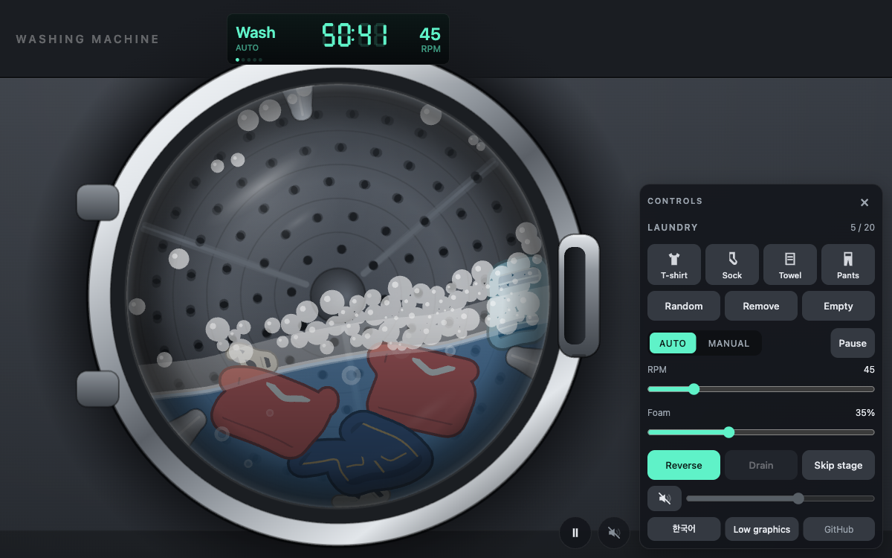

# Washing Machine

[English](#washing-machine) | [한국어](#세탁기)

A front-loading drum washing machine you can just sit and watch.
Soft-body laundry tumbles, soaks, and gets flung against the drum wall during spin, all in plain Canvas 2D with no dependencies.

**Live demo:** https://skykhs3.github.io/washing-machine/



## Features

- Full standard cotton course (about 57 minutes) that runs on its own: fill → wash → drain → short spin → two rinses with the same drain and short spin → 10 minute final spin → done, then repeats. The LED shows the time left in the course
- Add T-shirts, socks, towels, and pants, up to 20 items. Each type comes in designs a wardrobe would actually hold, in the colours it would hold them in, drawn as real garment parts rather than a repeating print: collars, armhole and side seams, chest stripes and breton stripes, contrast sleeves, sleeve hems, waistbands, cuffs and drawstrings, topstitching and slant pockets, woven and dobby towel borders, ribbed sock cuffs, toe caps and heel patches. On a black tee or a charcoal towel the seams are picked out lighter than the cloth rather than darker, the way they read in life. Socks go in and come out a pair at a time, and a pair counts as one item
- Water level, a surface that curves with the spin until the water is a ring against the wall, foam, and buoyancy for anything under the surface. A foam slider sets the detergent dose, from none to a drum full of suds, and the rinses only ever carry a fraction of the wash foam
- Laundry at the bottom of the pile is pressed flat by the weight above it, and a load pinned to the wall in a spin is pressed thin by the centrifugal field
- Manual mode with sliders for speed and water level, a direction toggle, and pause
- Procedural sound driven by the physics, calibrated against the balance of a real front loader: broadband rumble that carries the spin, water in the bubble band pulsed as the lifters scoop it, a fill whose Helmholtz resonance climbs three octaves as the tub fills, a drain pump led by its flow noise and impeller whine with the gurgle and cavitation of air breaking in, water flung out of a wet load during extraction, inlet valve clicks and the water hammer of the valve closing, the door interlock, thuds when laundry lands, and the little tune a home machine plays when the course ends. It starts muted; the speaker button next to pause turns it on, and the panel has a volume slider
- Works on desktop and mobile. The UI follows your browser language, English or Korean, and the panel has a button to switch. Your load, mode, manual settings, foam dose, language, and sound are all remembered between visits

## Controls

| Control | What it does |
|---|---|
| Laundry buttons / Random | Queue one piece; pieces drop in one at a time |
| Tap the door grip | Works the latch: the grip pulls out and springs back |
| Tap the console | Keypad beep |
| Remove / Empty | Remove the last piece or clear the drum |
| AUTO / MANUAL | Follow the wash program, or take over the motor |
| RPM slider, Reverse | Take over the motor; touching either switches to MANUAL. The mark on the track moves with the water: past it the water is flung into a ring against the wall, from 60 RPM with a brim-full drum to about 100 with a trace of water |
| Foam slider | Detergent dose. Sets how much foam the wash and MANUAL make, from none to a drum full of suds. Works in both modes. The mark on the track is the dose that gives a concentration of one |
| Water slider | Sets the level in the drum, from empty to brim full. Touching it switches to MANUAL, where the valve and the pump run wide open and the whole drum fills in about 30 seconds; in AUTO it reads out the level the program is at, filling and draining at the course's own pace. Filling it up in MANUAL and then handing the machine back to AUTO pulls the fill stage forward, since the water it was there to move is already in. The mark on the track is the level the program itself fills to |
| Pause, Prev / Skip | Cut the motor and the valves, so the drum coasts to a stop and the program waits where it stands. Or step back and forward through the stages in AUTO |
| Speaker button, volume slider | Sound starts off. Tap the speaker to turn it on, then set the level in the panel |
| Reset all | Clears the saved state and reloads, back to a first visit |
| × / Controls | Close the panel, or bring it back with the Controls button |
| Space, ← →, ↑ ↓, A, S, Esc | Pause, reverse / forward, RPM ±5, mode toggle, skip stage, toggle panel. The arrow keys switch to MANUAL |

## Wash program

Timings follow a typical standard cotton course on a household front loader.

| Stage | Length | Drum | Water |
|---|---|---|---|
| Fill | 3 min | stopped | fills to 35 % |
| Wash | 18 min | 45 RPM, 12 s each way with 3 s pauses | 35 % |
| Drain | 1.5 min | stopped | drains |
| Spin | 2 min | 60 RPM to distribute, 120 RPM, coast down | empty |
| Fill / Rinse / Drain / Spin | 2.5 / 5 / 1.3 / 2 min | as above | 30 % |
| Fill / Rinse / Drain | 2.5 / 5 / 1.3 min | as above | 30 % |
| Final spin | 10 min | 60 → 120 → 200 RPM, 1 min coast down | empty |
| Done | 2 min | stopped | empty |

Total: about 56 minutes, then the course starts again. Fill and drain take their time from the water rather than from the clock: each is paced to use nearly the whole of its stage, and a drum that is already at the level it is being filled to only waits out the few seconds left on the end of that stage instead of a fill it does not need. The RPM shown is the simulated drum speed. Real spin speeds (800 ~ 1200 RPM) cannot be shown meaningfully at 60 fps, so the final spin runs at 200 RPM. Anything above ~60 RPM already pins the laundry to the wall because the drum radius and gravity are scaled like a real 50 cm drum.

## How it works

- **Laundry** is a small grid of particles joined by distance constraints (structural plus diagonal shear) and solved with position-based dynamics on top of Verlet integration. Wet laundry gets heavier, floppier, and darker.
- **Laundry compacts under load.** The load a piece carries is read off the contact network. Every piece weighs its mass in the effective gravity at its centroid, gravity less buoyancy plus the centrifugal term, and, taken from the top of the pile down, hands that weight and whatever has landed on it to the pieces and the wall it rests on, split by how many contacts point along that gravity. What arrives from above plus half its own weight is the pressure across it, in particle weights per particle, and the lattice rest lengths shorten along the effective gravity by a compaction law that saturates at 45 %. The rest lengths are the template squeezed along that axis, with the piece's orientation tracked rather than fitted fresh each step, so every member follows one affine map and the rows, columns and diagonals agree instead of fighting. Compaction is quasi-static: a piece only compacts or lofts back once it has been at rest relative to the drum for a moment, follows the load estimate only when it has moved by more than a small band, and the change is applied as a squeeze of the piece about its centroid that carries no velocity. Cloth packs in about a second and lofts back in about two. So the piece at the bottom of the pile is pressed flat by the ones above it, everything pinned to the wall in a spin is pressed thin by the 11 g field, and a piece under water, being buoyant, hardly compacts at all. Past a load whose lattice area is about the drum's, the pieces can only fit folded over themselves and compaction fades out, since squeezing a folded lattice sets its self-contacts against its constraints.
- **What a garment is wearing** is a list of marks written in continuous grid coordinates: u across the mask columns, v down its rows. Each sample point is compiled once into an affine combination of nearby particles, so drawing one is a few multiply-adds and the mark bends with the cloth rather than riding on it as a rigid overlay. Coordinates outside the mask are extrapolated from the local lattice, which is how a hem reaches the silhouette edge instead of stopping a half stroke short of it; the outline clips whatever overshoots. A cell on a one cell wide tab, a sleeve on this grid, has no neighbour above or below, so its missing direction is taken from the average lattice step of the whole piece. Marks of the same colour and width are merged into one path at compile time.
- **The drum** is a circular boundary with three lifter capsules that rotate with it. Contacts get Coulomb friction against the moving wall, so at low speed clothes ride up the wall and fall, and at high speed the centripetal term keeps them pinned.
- **Water** applies buoyancy and drag below its surface, and that surface is an equipotential of the field the drum actually turns in: gravity plus the centrifugal term. With y down and the drum radius 1 the potential is `phi = -g y - w^2 (x^2 + y^2) / 2`, whose level sets rearrange to `x^2 + (y + g/w^2)^2 = const`: circles about the one point where the two fields cancel. So the surface is a circular arc, not the paraboloid a vertical axis would give. Standing still that centre runs off above the drum and the arc flattens into the level line; at speed it closes on the drum axis until the water is a ring with a hole down the middle, and foam driven inward by the same field surfaces in that hole instead of collecting under a line it can never reach. Spinning up neither creates nor destroys water, so the arc's radius is solved each step from the area the level covers standing still rather than carried around as a height. That equipotential holds only while the water can settle into a surface that stands still in the room. Once the drum turns fast enough to carry the water round with it, past `Fr = w^2 R / g` of one, gravity in the drum's own frame turns once per revolution instead, and a film held on by the centrifugal field varies in thickness by only `h/Fr` about its mean; so the centre's offset is scaled by the mean depth and the water wraps the whole wall rather than pooling into a crescent that leaves the top of it dry. The lag that leans a level surface fades out on the same factor, since water turning with the wall does not slosh against it. Buoyancy itself is still applied straight up, which is the approximation the load physics was tuned on.
- **Foam** is air entrained into a surfactant solution, so it needs both detergent and mechanical work. Entrainment is gated by the Froude number `Fr = w^2 R / g`: below the centrifuging threshold the load rides up the wall and drops back through the water, which drags air under, and above it everything is pinned to the wall and the plunging stops. With the drum scaled like a real 50 cm machine the threshold lands near 60 RPM, so foam peaks around 50 ~ 60 RPM and collapses above that. The amount is a volume integrated as `dV/dt = G(1 - V) - V/tau`, so it climbs to a plateau over tens of seconds instead of growing without bound, and sags once the agitation stops. What a full plateau is depends on the dose. The foam slider is the detergent, and the interface a concentration can stabilise grows with it faster than linearly (`capacity = (s / s_max)^1.3`), so the slider sets both how fast the head builds and how high it can get: at the top it fills the drum, and the bubbles scale up with the head so a full drum is a few hundred large ones rather than thousands of small ones. In AUTO the dose scales every stage of the program, so the rinses, which start with the diluted leftovers, keep a small fraction of the wash foam at any dose; in MANUAL it is the concentration itself. Filling foams on its own because the incoming jet entrains air, each rinse starts with less surfactant so its foam is weaker and shorter lived, and draining thins the films so the head collapses as the level falls. Individual bubbles rise at a terminal velocity proportional to `r^2` along the *effective* gravity, which is gravity plus the centrifugal term, so at speed they migrate toward the drum axis rather than straight up; they coarsen as `dr/dt = k/r` (Ostwald ripening, mean radius growing like `sqrt(t)`) until the film ruptures. Above the surface the foam is given cohesion so it packs, rides up the wall, and shears off in clumps. The foam does not push back on the laundry or the water.
- Drive it in MANUAL with the water on and sweep the RPM to see the non-monotonic response; `?debug` prints `Fr`, the tumbling gate, the generation rate, the foam volume, the capacity the dose allows, and the head height.
- **The door** has hinges on the left and the grip on the right. The grip is drawn outside the cached glass layer because it animates: tapping it works the latch, which draws the grip out of the door the way a hand hooked in the pocket would, springs back past rest, and fires a click. Tapping the console beeps. Neither changes any state; they are there because a machine you sit and watch should answer when you touch it.
- **Sound** is synthesised with the Web Audio API from oscillators and one noise buffer, which several phase-offset sources read so the beds are not filtered copies of the same signal. Sound starts off, so the first thing that opens the output is the speaker button, and that press is itself the gesture browsers ask for. Nothing is guessed about when one arrives, and the output stays closed until someone actually wants it. On iOS the session type is raised to `playback`, because Web Audio otherwise sits in the `ambient` category and is silenced by the hardware mute switch, and the context is resumed from `interrupted` as well as `suspended` so it comes back after a screen lock or a call.
- **What the sound is modelled on.** Levels are set so the A-weighted balance between stages matches a real machine, where extraction is far louder than a tumble wash. Imbalance force grows with the square of the drum speed, but what reaches the cabinet is that force times the suspension transmissibility, so a spin-up swells as it passes the suspension resonance near 90 rpm, settles once it is running supercritical and the tub centres itself, and climbs again with speed while air noise takes over. The once-per-revolution modulation is faded out almost entirely above the resonance: the drum tops out at 200 rpm, so it runs at 3.3 Hz where a real extraction runs at 20 Hz, and modulation that slow is heard as separate swells rather than as roughness. An edge dipole radiates as the cube of speed, so full extraction ends up brighter rather than merely louder. A drain pump is carried by turbulence in the volute and the hose and by the motor whine a couple of harmonics above its slot rate, not by the blade rate: energy packed into one narrow band at 280 Hz reads as a hum, where a real pump is a high whirr, so the blade filter is left wide and quiet. Water noise is confined to the band the Minnaert resonance `f = 3.28/a` gives for the bubble sizes water entrains, roughly 320 Hz to 4 kHz; unbounded noise puts most of its energy above 8 kHz and reads as hiss rather than water. Water is pulsed at the rate the three lifters pass, which is the rhythm a front loader actually has, over the slower rocking of the water body at `sqrt(g/R)/2pi`. Pitches are proportional to speed with no constant offset, so timbre brightens with rpm rather than merely transposing; because the drum tops out at 200 rpm, an 11 g extraction against a real machine's 1200 rpm, tonal pitch follows a warped speed that maps the tumble to its true rate and the spin to the pitch of a real extraction, while levels use the unwarped speed. Impacts ring the cabinet as fixed decaying sinusoids rather than a swept tone, wet cloth landing darker and shorter than dry; laundry going under the surface is left silent, since at the rate a tumble drops it the splashes were more distraction than machine. Hits arriving in the same frame are merged by the incoherent-sum rule, each quieter by `1/sqrt(n)`, instead of being thinned to one.
- **Rendering** uses one canvas. The machine body, back plate, glass, and LED display are cached offscreen. Fast rotation is drawn as a running average of sub-frame poses cross-faded into a pre-blurred back plate so the hole pattern never strobes.

## Run locally

ES modules do not load from `file://`, so serve the folder:

```sh
python3 -m http.server 8000
# then open http://localhost:8000
```

Add `?debug` to the URL for particles, constraints, lifter capsules, the compaction of the most loaded piece, frame timings, the foam state, and the audio output state. Add `?reset` to clear saved state; the Reset all button in the panel does the same and reloads.

## Project layout

```
index.html, style.css      page and overlay UI
src/main.js                loop, fixed-step accumulator, app state
src/config.js              tuning constants, wash program, laundry types
src/cycle.js               wash program state machine
src/physics/               world (SoA particles), soft bodies, drum, water, motor, spatial hash
src/render/                viewport, body, back plate, water, laundry, lifters, foam, glass, door handle, HUD
src/ui/                    panel, laundry picker, panel toggle, canvas taps, localStorage
```

## Browser support

Any recent browser with ES modules, `ResizeObserver`, `Path2D`, and Pointer Events.

## License

MIT

---

# 세탁기

[English](#washing-machine) | [한국어](#세탁기)

그냥 앉아서 구경하는 드럼 세탁기입니다.
말랑한 빨래가 굴러다니고, 물에 잠기고, 탈수 때 드럼 벽에 붙습니다. 전부 의존성 없는 Canvas 2D로 그렸습니다.

**데모:** https://skykhs3.github.io/washing-machine/


## 주요 기능

- 표준 면 코스(약 57분)가 알아서 돌아갑니다. 급수 → 세탁 → 배수 → 짧은 탈수 → 같은 배수와 짧은 탈수를 붙인 헹굼 두 번 → 10분 최종 탈수 → 종료, 그리고 다시 처음부터. LED에는 코스의 남은 시간이 뜹니다
- 티셔츠, 양말, 수건, 바지를 최대 20개까지 넣을 수 있습니다. 종류마다 옷장에 실제로 있을 법한 디자인이 여러 개 있고, 색도 사람들이 실제로 입는 색입니다. 반복 무늬가 아니라 실제 옷의 부위를 그립니다. 칼라, 진동과 옆 솔기, 가슴 줄무늬와 보더 스트라이프, 색이 다른 소매, 소매 밑단, 허리 밴드와 밑단과 허리끈, 스티치와 사선 주머니, 수건의 짜임 테두리와 도비 보더, 양말의 골지 목과 발끝 보강과 뒤꿈치 패치. 검정 티셔츠나 차콜 수건처럼 어두운 옷에서는 솔기를 바탕보다 어둡게가 아니라 밝게 뽑아 실물처럼 보이게 합니다. 양말은 한 쌍씩 들어가고 한 쌍씩 나오며, 한 쌍을 하나로 셉니다
- 수위, 회전에 따라 휘어 끝내 벽에 붙은 고리가 되는 수면, 거품, 그리고 수면 아래 물체에 걸리는 부력. 거품 슬라이더로 세제량을 정하며, 없음부터 드럼이 거품으로 가득 차는 것까지 볼 수 있습니다. 헹굼은 어느 경우에도 세탁 거품의 일부만 남습니다
- 더미 아래에 깔린 빨래는 위 무게에 눌려 납작해지고, 탈수 때 벽에 붙은 빨래는 원심력에 얇게 눌립니다
- 회전 속도와 물 높이 슬라이더, 역회전, 일시정지를 직접 만지는 수동 모드
- 물리 상태가 그대로 소리가 됩니다. 실제 드럼 세탁기의 음량 균형에 맞춰 보정했습니다. 탈수를 끌고 가는 광대역 저음, 리프터가 물을 퍼 올릴 때마다 기포 대역에서 맥동하는 물소리, 통이 차오르며 Helmholtz 공진이 세 옥타브 올라가는 급수음, 흐름 잡음과 임펠러 소리가 이끌고 공기가 섞여 들며 꾸르륵거리는 배수 펌프, 탈수 중 젖은 빨래에서 튀어 나가는 물, 급수 밸브의 딸깍임과 밸브가 닫힐 때의 수격, 문 잠금, 빨래가 떨어지는 둔탁한 소리, 코스가 끝날 때 가정용 기계가 울리는 것 같은 종료 멜로디까지 있습니다. 소리는 꺼진 채로 시작합니다. 일시정지 옆의 스피커 버튼으로 켜고, 크기는 조작 패널의 볼륨 슬라이더로 맞춥니다
- 데스크톱과 모바일 모두에서 동작합니다. UI 언어는 브라우저 언어를 따라 영어나 한국어로 뜨고 패널의 버튼으로 바꿀 수 있으며, 빨래와 모드, 수동 설정, 거품량, 언어, 소리는 다음 방문에도 남습니다

## 조작

| 조작 | 하는 일 |
|---|---|
| 빨래 버튼 / 랜덤 | 한 개를 대기열에 넣습니다. 한 번에 하나씩 떨어집니다 |
| 문 손잡이 누르기 | 래치가 움직입니다. 손잡이가 바깥으로 당겨졌다가 튕겨 돌아옵니다 |
| 콘솔 누르기 | 조작부 알림음 |
| 빼기 / 비우기 | 마지막에 넣은 것을 빼거나, 드럼을 비웁니다 |
| 자동 / 수동 | 세탁 코스를 따르거나, 모터를 직접 잡습니다 |
| RPM 슬라이더, 역회전 | 모터를 직접 돌립니다. 둘 중 하나를 만지면 수동으로 바뀝니다. 트랙의 눈금은 물 양에 따라 움직이며, 그 위에서는 물이 벽에 붙은 고리가 됩니다. 가득이면 60 RPM, 조금이면 100 RPM 근처입니다 |
| 거품 슬라이더 | 세제량입니다. 세탁 단계와 수동 모드의 거품 양을 없음부터 드럼 가득까지 정합니다. 두 모드 모두에서 동작합니다. 트랙의 눈금은 농도가 1이 되는 세제량입니다 |
| 물 슬라이더 | 드럼의 물 높이를 비움부터 가득까지 정합니다. 만지면 수동으로 바뀌며, 수동에서는 밸브와 펌프를 활짝 열어 드럼 전체가 30초쯤에 찹니다. 자동에서는 코스가 만드는 수위를 코스의 속도로 보여 줍니다. 수동에서 미리 채워 두고 자동으로 되돌리면 급수 단계가 앞당겨집니다. 그 단계가 옮기려던 물이 이미 들어 있기 때문입니다. 트랙의 눈금은 코스가 채우는 수위입니다 |
| 일시정지, 이전 단계 / 다음 단계 | 모터와 밸브를 끊습니다. 드럼이 관성으로 멈추고 코스는 멈춘 자리에서 기다립니다. 또는 자동에서 단계를 앞뒤로 옮깁니다 |
| 스피커 버튼, 볼륨 슬라이더 | 소리는 꺼진 채로 시작합니다. 스피커를 눌러 켜고, 크기는 패널에서 맞춥니다 |
| 전체 초기화 | 저장된 상태를 지우고 다시 불러와 첫 방문으로 되돌립니다 |
| × / 조작 | 패널을 닫거나, 조작 버튼으로 다시 엽니다 |
| Space, ← →, ↑ ↓, A, S, Esc | 일시정지, 역회전 / 정회전, RPM ±5, 모드 전환, 다음 단계, 패널 열고 닫기. 방향키를 누르면 수동으로 바뀝니다 |

## 세탁 코스

가정용 드럼 세탁기의 표준 면 코스 시간을 따릅니다.

| 단계 | 길이 | 드럼 | 물 |
|---|---|---|---|
| 급수 | 3분 | 정지 | 35 %까지 채움 |
| 세탁 | 18분 | 45 RPM, 12초씩 방향을 바꾸고 사이에 3초 정지 | 35 % |
| 배수 | 1.5분 | 정지 | 뺌 |
| 탈수 | 2분 | 60 RPM으로 고르게 편 뒤 120 RPM, 관성으로 감속 | 없음 |
| 급수 / 헹굼 / 배수 / 탈수 | 2.5 / 5 / 1.3 / 2분 | 위와 같음 | 30 % |
| 급수 / 헹굼 / 배수 | 2.5 / 5 / 1.3분 | 위와 같음 | 30 % |
| 최종 탈수 | 10분 | 60 → 120 → 200 RPM, 1분 관성 감속 | 없음 |
| 종료 | 2분 | 정지 | 없음 |

전부 합쳐 약 56분이고, 끝나면 코스를 다시 시작합니다. 급수와 배수는 시계가 아니라 물에서 시간을 읽습니다. 물이 단계를 거의 다 쓰도록 속도를 잡았고, 채우려는 수위에 이미 도달해 있는 드럼은 필요 없는 급수를 기다리는 대신 그 단계 끝에 남은 몇 초만 기다립니다. 화면에 뜨는 RPM은 시뮬레이션된 드럼 속도입니다. 실제 탈수 속도(800 ~ 1200 RPM)는 60 fps로 의미 있게 보여줄 수 없어서 최종 탈수를 200 RPM으로 돌립니다. 드럼 반지름과 중력을 실제 50 cm 드럼에 맞춰 잡았기 때문에, 약 60 RPM만 넘어도 빨래는 이미 벽에 붙습니다.

## 동작 원리

- **빨래**는 거리 제약(구조 제약과 대각 전단 제약)으로 이어 붙인 작은 입자 격자입니다. Verlet 적분 위에서 위치 기반 동역학으로 풉니다. 젖은 빨래는 더 무겁고, 더 흐물흐물하고, 더 어두워집니다.
- **빨래는 하중에 눌립니다.** 한 벌이 받는 하중은 접촉 관계에서 읽어 냅니다. 각 벌은 무게중심에서의 유효 중력, 즉 중력에서 부력을 빼고 원심 항을 더한 값으로 자기 질량만큼의 무게를 갖고, 더미 맨 위부터 차례로 자기 무게와 위에서 받은 하중을 자기가 얹혀 있는 벌과 벽에 넘깁니다. 접촉 방향이 그 중력과 얼마나 나란한지에 비례해 나눠 줍니다. 위에서 받은 하중에 자기 무게의 절반을 더한 값이 그 옷을 가로지르는 압력(입자 하나당 입자 무게 단위)이고, 격자의 rest 길이를 유효 중력 방향으로 압축 법칙에 따라 줄이며 최대 45 %에서 포화합니다. rest 길이는 템플릿을 그 방향으로 눌러 얻고, 옷의 회전은 매 스텝 새로 맞추지 않고 추적하므로 모든 제약이 같은 아핀 변형을 따라 구조·전단 제약이 서로 싸우지 않습니다. 압축은 준정적입니다. 드럼에 대해 잠시 정지한 옷만 눌리거나 부풀고, 하중 추정치가 일정 폭 이상 움직였을 때만 따라가며, 변화는 무게중심 기준의 기하학적 스퀴즈로 적용해 속도를 만들지 않습니다. 옷감은 약 1초에 눌리고 약 2초에 걸쳐 부풀어 돌아옵니다. 그래서 더미 맨 아래 옷은 위 옷들에 납작하게 눌리고, 탈수 때 벽에 붙은 빨래는 11 g의 원심력에 얇게 눌리며, 물속의 옷은 부력 때문에 거의 눌리지 않습니다. 적재된 격자 면적이 드럼 면적에 이르면 옷이 접혀서만 들어가는 상태라 압축이 꺼집니다. 접힌 격자를 조이면 자기 접촉과 제약이 서로 싸우기 때문입니다.
- **옷에 그려지는 디테일**은 연속적인 격자 좌표로 적어 둔 자국의 목록입니다. u는 마스크의 열을 가로지르고, v는 행을 따라 내려갑니다. 각 샘플 점은 한 번만 주변 입자들의 아핀 결합으로 컴파일해 두므로, 하나를 그리는 데 곱셈과 덧셈 몇 번이면 되고 자국이 천 위에 뻣뻣하게 얹히는 대신 천을 따라 휩니다. 마스크 바깥 좌표는 주변 격자에서 외삽합니다. 밑단이 반 획 못 미쳐 끊기지 않고 실루엣 가장자리까지 닿는 것이 이 덕분이고, 넘친 부분은 외곽선이 잘라냅니다. 이 격자에서 소매처럼 폭이 한 칸인 돌출부의 칸은 위아래 이웃이 없으므로, 없는 방향의 간격은 조각 전체의 평균 격자 간격에서 가져옵니다. 색과 두께가 같은 자국은 컴파일 시점에 하나의 경로로 합칩니다.
- **드럼**은 원형 경계에 함께 도는 리프터 캡슐 세 개가 붙은 형태입니다. 접촉에는 움직이는 벽에 대한 쿨롱 마찰이 걸립니다. 그래서 느릴 때는 옷이 벽을 타고 올라갔다가 떨어지고, 빠를 때는 구심 항이 옷을 벽에 붙여 둡니다.
- **물**은 수면 아래에서 부력과 항력을 겁니다. 그 수면은 드럼이 실제로 도는 장, 곧 중력과 원심력을 합친 장의 등포텐셜면입니다. y를 아래로 두고 드럼 반지름을 1로 잡으면 포텐셜은 `phi = -g y - w^2 (x^2 + y^2) / 2`이고, 등위면을 정리하면 `x^2 + (y + g/w^2)^2 = const`, 즉 두 힘이 정확히 상쇄되는 한 점을 중심으로 하는 원이 됩니다. 그래서 수면은 세로축 기계라면 나왔을 포물면이 아니라 원호입니다. 드럼이 서 있으면 그 중심이 드럼 위 멀리로 달아나 원호가 수평선으로 펴지고, 속도가 붙으면 중심이 드럼 축으로 다가와 물이 가운데 뚫린 고리가 됩니다. 같은 장에 안쪽으로 떠밀린 거품은 닿을 수 없는 선 아래에 고이는 대신 그 구멍에서 수면으로 올라옵니다. 회전을 올린다고 물이 생기거나 사라지지는 않으므로, 원호의 반지름은 높이로 들고 다니는 대신 정지 상태에서 그 수위가 덮는 면적으로부터 매 스텝 풀어냅니다. 이 등포텐셜은 물이 실험실에서 정지한 수면으로 가라앉을 수 있는 동안만 성립합니다. 드럼이 물을 함께 싣고 돌 만큼 빨라지면, 즉 `Fr = w^2 R / g`가 1을 넘으면 드럼 좌표의 중력이 회전 1회마다 한 바퀴 돕니다. 원심력으로 붙어 있는 막의 두께는 평균 대비 `h/Fr`만큼만 변하므로 중심 오프셋에 평균 깊이를 곱합니다. 그러면 물이 초승달로 고여 벽 위쪽을 마른 채 두는 대신 벽 전체를 두릅니다. 수면을 기울이던 지연도 같은 계수로 사라집니다. 벽과 함께 도는 물은 벽에 대해 출렁이지 않기 때문입니다. 부력 자체는 여전히 연직 위로만 겁니다. 빨래 물리가 그 근사 위에서 맞춰져 있기 때문입니다.
- **거품**은 계면활성제 용액에 말려 들어간 공기라서, 세제와 기계적인 일이 둘 다 있어야 생깁니다. 공기가 말려 들어가는지는 Froude 수 `Fr = w^2 R / g`가 정합니다. 원심 분리 문턱 아래에서는 빨래가 벽을 타고 올라갔다 물속으로 떨어지면서 공기를 끌고 들어가고, 문턱 위에서는 전부 벽에 붙어 버려 떨어지는 일 자체가 없어집니다. 드럼을 실제 50 cm 세탁기처럼 잡으면 문턱이 60 RPM 근처에 놓이므로, 거품은 50 ~ 60 RPM에서 가장 많고 그 위에서는 꺼집니다. 양은 `dV/dt = G(1 - V) - V/tau`로 적분하는 부피라서, 끝없이 자라는 대신 수십 초에 걸쳐 평탄한 값까지 올라갔다가 휘젓기가 멈추면 주저앉습니다. 그 평탄한 값이 얼마인지는 세제량이 정합니다. 거품 슬라이더가 세제이고, 농도가 안정화할 수 있는 계면은 농도보다 빠르게 늘어나므로(`capacity = (s / s_max)^1.3`), 슬라이더는 거품이 쌓이는 속도와 최대 높이를 함께 정합니다. 최대에서는 드럼을 가득 채우며, 기포도 거품 머리와 함께 커져서 가득 찬 드럼은 수천 개의 작은 기포가 아니라 수백 개의 큰 기포로 이뤄집니다. 자동에서는 세제량이 코스의 모든 단계에 곱해지므로, 희석된 잔여 세제로 시작하는 헹굼은 어느 세제량에서도 세탁 거품의 일부만 남기고, 수동에서는 세제량이 곧 농도입니다. 급수는 들어오는 물줄기가 공기를 말아 넣어 그 자체로 거품을 만들고, 헹굼은 회차마다 계면활성제가 줄어 거품이 약하고 빨리 사라지며, 배수는 막을 얇게 만들어 수위가 내려가는 동안 거품 머리가 무너집니다. 기포 하나하나는 `r^2`에 비례하는 종단 속도로 *유효* 중력을 따라 오릅니다. 유효 중력은 중력에 원심 항을 더한 것이라, 드럼이 빠를 때는 곧장 위가 아니라 드럼 축 쪽으로 옮겨 갑니다. 막이 터질 때까지 `dr/dt = k/r`로 굵어집니다(Ostwald 숙성, 평균 반지름이 `sqrt(t)`처럼 자랍니다). 수면 위의 거품에는 응집력을 줘서 서로 뭉치고, 벽을 타고 올라가고, 덩어리째 떨어져 나갑니다. 거품이 빨래나 물을 되밀지는 않습니다.
- 수동 모드에서 급수를 켜고 RPM을 훑으면 단조롭지 않은 반응을 볼 수 있습니다. `?debug`를 붙이면 `Fr`, 텀블링 게이트, 생성률, 거품 부피, 세제량이 허용하는 용량, 거품 머리 높이가 함께 표시됩니다.
- **문**은 왼쪽에 힌지가, 오른쪽에 손잡이가 있습니다. 손잡이는 움직이기 때문에 캐시해 둔 유리 레이어 바깥에 그립니다. 누르면 래치가 움직입니다. 주머니에 손을 걸어 당기듯 손잡이가 바깥으로 빠져나왔다가 제자리를 지나 튕겨 돌아오고 딸깍 소리가 납니다. 콘솔을 누르면 삑 소리가 납니다. 둘 다 상태를 바꾸지는 않습니다. 앉아서 구경하는 기계라면 만졌을 때 반응은 해야 한다고 봐서 넣었습니다.
- **소리**는 Web Audio API의 오실레이터와 노이즈 버퍼 하나로 합성합니다. 노이즈 버퍼는 위상을 어긋나게 둔 여러 소스가 읽으므로, 바탕 소리들이 같은 신호를 필터만 달리한 복사본이 되지 않습니다. 소리는 꺼진 채로 시작합니다. 그래서 출력을 여는 첫 동작이 스피커 버튼이고, 그 누름 자체가 브라우저가 요구하는 사용자 제스처가 됩니다. 제스처가 언제 올지 추측하지 않고, 누군가 실제로 원할 때까지 출력을 닫아 둡니다. iOS에서는 세션 타입을 `playback`으로 올립니다. 그러지 않으면 Web Audio가 `ambient` 범주에 머물러 기기의 무음 스위치에 막히기 때문입니다. 컨텍스트는 `suspended`뿐 아니라 `interrupted`에서도 되살리므로 화면 잠금이나 통화 뒤에도 돌아옵니다.
- **소리가 무엇을 본떴는지.** 음량은 단계 사이의 A 가중 균형이 실제 기계와 맞도록 잡았습니다. 실제로도 탈수는 텀블 세탁보다 훨씬 큽니다. 불균형 힘은 드럼 속도의 제곱으로 커지지만 몸체까지 닿는 것은 그 힘에 서스펜션 전달률을 곱한 값입니다. 그래서 속도를 올리는 동안 90 rpm 근처의 서스펜션 공진을 지날 때 소리가 부풀고, 공진 위로 올라가 통이 스스로 중심을 잡으면 잦아들었다가, 속도와 함께 다시 커지면서 공기 소음이 주도권을 가져갑니다. 회전당 한 번 걸리는 변조는 공진 위에서 거의 완전히 걷어냅니다. 드럼이 200 rpm에서 멈추니 3.3 Hz로 도는데 실제 탈수는 20 Hz이고, 그렇게 느린 변조는 거칠기가 아니라 따로따로 부푸는 소리로 들리기 때문입니다. 가장자리 쌍극자는 속도의 세제곱으로 방사하므로, 최대 탈수는 그저 커지는 대신 밝아집니다. 배수 펌프는 날개 통과 주파수가 아니라 볼류트와 호스의 난류, 그리고 슬롯 주파수보다 두어 배음 위에 있는 모터 소리가 끌고 갑니다. 280 Hz 좁은 대역에 에너지를 몰아넣으면 웅웅거림으로 들리는데 실제 펌프는 높게 도는 소리라서, 날개 성분 필터는 넓고 조용하게 뒀습니다. 물소리는 물이 말아 넣는 기포 크기에 대해 Minnaert 공진 `f = 3.28/a`가 주는 대역, 대략 320 Hz ~ 4 kHz 안에 가둡니다. 대역을 묶지 않은 잡음은 에너지 대부분이 8 kHz 위에 몰려 물이 아니라 쉭쉭거림으로 들립니다. 물소리는 리프터 세 개가 지나가는 주기로 맥동합니다. 드럼 세탁기가 실제로 내는 리듬이고, 그 아래에는 `sqrt(g/R)/2pi`로 더 느리게 출렁이는 물 전체의 움직임이 깔립니다. 음정은 상수 오프셋 없이 속도에 비례하므로, 음색이 단순히 조옮김되는 대신 rpm과 함께 밝아집니다. 다만 드럼이 200 rpm에서 멈추는 반면 실제 기계의 1200 rpm 탈수는 11 g이므로, 음정만은 속도를 한 번 구부린 값을 따릅니다. 텀블은 실제 회전수로, 탈수는 실제 탈수의 음높이로 대응시키고 음량은 구부리지 않은 속도를 씁니다. 충격은 훑고 지나가는 톤이 아니라 고정된 감쇠 사인파로 몸체를 울리고, 젖은 천이 떨어질 때는 마른 천보다 어둡고 짧습니다. 빨래가 수면 아래로 들어갈 때는 소리를 내지 않습니다. 텀블이 빨래를 떨어뜨리는 빈도에서는 물 튀는 소리가 기계 소리라기보다 방해에 가까웠기 때문입니다. 같은 프레임에 겹친 충격은 하나로 솎아내지 않고 비간섭 합 규칙으로 합칩니다. 각각은 `1/sqrt(n)`만큼 조용해집니다.
- **렌더링**은 캔버스 하나로 합니다. 본체, 드럼 뒷판, 유리, LED 표시는 오프스크린에 캐시합니다. 빠른 회전은 서브 프레임 자세들의 이동 평균으로 그린 뒤 미리 흐려 둔 뒷판과 교차 페이드하므로, 구멍 무늬가 깜빡이지 않습니다.

## 로컬에서 실행

ES 모듈은 `file://`에서 로드되지 않으므로, 폴더를 서버로 띄웁니다.

```sh
python3 -m http.server 8000
# 그다음 http://localhost:8000 접속
```

URL에 `?debug`를 붙이면 입자, 제약, 리프터 캡슐, 가장 많이 눌린 옷의 압축율, 프레임 시간, 거품 상태, 오디오 출력 상태가 보입니다. `?reset`을 붙이면 저장된 상태를 지웁니다. 패널의 전체 초기화 버튼도 같은 일을 하고 페이지를 다시 불러옵니다.

## 프로젝트 구조

```
index.html, style.css      페이지와 오버레이 UI
src/main.js                루프, 고정 시간 간격 누적기, 앱 상태
src/config.js              튜닝 상수, 세탁 코스, 빨래 종류
src/cycle.js               세탁 코스 상태 기계
src/physics/               월드(SoA 입자), 소프트바디, 드럼, 물, 모터, 공간 해시
src/render/                뷰포트, 본체, 뒷판, 물, 빨래, 리프터, 거품, 유리, 문 손잡이, 계기판
src/ui/                    패널, 빨래 선택, 패널 토글, 캔버스 탭, localStorage
```

## 브라우저 지원

ES 모듈, `ResizeObserver`, `Path2D`, 포인터 이벤트를 지원하는 최근 브라우저면 됩니다.

## 라이선스

MIT
